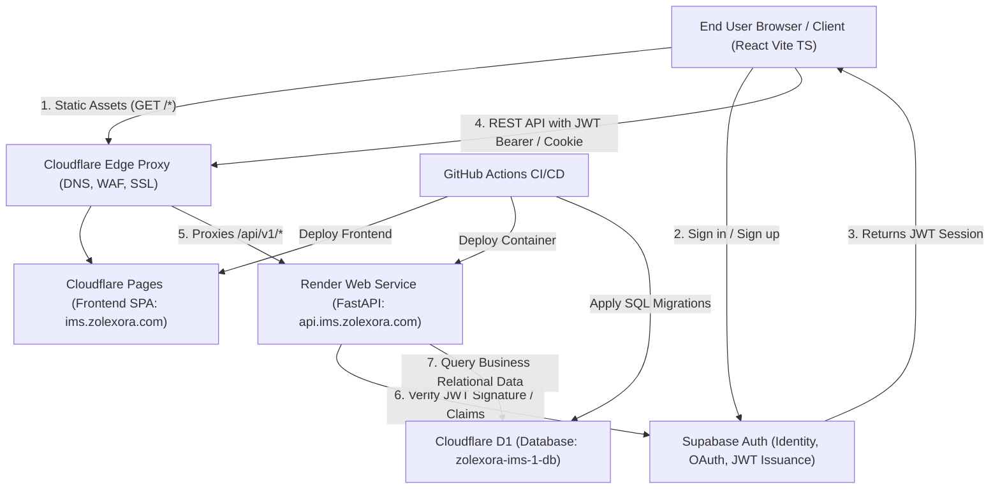

# Phase 0 Architecture Decision Document: Supabase Auth + Cloudflare D1 Data + Render + Cloudflare Pages

## 1. Project Metadata & Inputs

- **Repository**: `https://github.com/Zolexora/Zolexora_IMS` (Local Path: `/workspaces/Zolexora_IMS`)
- **Frontend Domain**: `ims.zolexora.com` (Hosted on Cloudflare Pages with apex DNS & edge SSL)
- **Backend Service Name**: `zolexora-ims-api` (Render Web Service; custom API domain: `api.ims.zolexora.com`)
- **Supabase Project (Auth Only)**:
  - `SUPABASE_URL`: `https://<PROJECT_REF>.supabase.co`
  - `SUPABASE_ANON_KEY`: `<SUPABASE_ANON_KEY>` (Client-side auth SDK)
  - `SUPABASE_SERVICE_KEY`: `<SUPABASE_SERVICE_KEY>` (Backend admin & token verification)
- **Cloudflare D1 Database (Application Data Only)**:
  - `CLOUDFLARE_ACCOUNT_ID`: `<CLOUDFLARE_ACCOUNT_ID>`
  - `CLOUDFLARE_D1_DATABASE_NAME`: `zolexora-ims-1-db`
  - `CLOUDFLARE_D1_DATABASE_ID`: `63b1b80b-ee96-4948-acce-c96d6ac65f61`
  - `CLOUDFLARE_API_TOKEN`: `<CLOUDFLARE_D1_API_TOKEN>`
- **Monorepo Preservation**: Zero regressions or file deletions in `apps/ims-user` and `apps/ims-admin`. Legacy workers and single-file bundles continue to operate concurrently during phased migration.

---

## 2. System Architecture



---

## 3. Separation of Responsibilities

| Subsystem | Provider | Role & Scope |
| :--- | :--- | :--- |
| **Identity & Authentication** | **Supabase Auth** | **Strictly Auth Only**: User registration, login, email verification, password reset, MFA, session token generation, and OAuth providers. No business data is stored here. |
| **Application Relational Data** | **Cloudflare D1** | **Application Data Only**: High-performance serverless SQLite at the edge storing all 13 business tables (`organizations`, `stores`, `selling_points`, `users`, `products`, `suppliers`, `sales`, `purchases`, `expenses`, `audit_logs`). |
| **API & Business Logic** | **Render (FastAPI)** | Multi-tenant inventory calculations, transaction validation, PDF generation, role-based authorization, and D1 database queries. |
| **Client Interface** | **Cloudflare Pages** | Fast, globally cached React Vite TypeScript multi-page application. |

---

## 4. Authentication Approach & User Resolution

1. **Client Authentication**:
   - The React frontend initializes `@supabase/supabase-js` using `SUPABASE_URL` and `SUPABASE_ANON_KEY`.
   - Users authenticate directly against Supabase Auth via email/password, magic links, or OAuth.
2. **Token Passing**:
   - **Web Application**: Frontend transmits the Supabase Access Token (JWT) in the `Authorization: Bearer <JWT>` header or an HttpOnly session cookie.
3. **Backend Validation & User Mapping**:
   - FastAPI dependency (`get_current_user`) intercepts incoming API requests.
   - Validates the Supabase JWT cryptographically using Supabase's public JWKS endpoint (`/.well-known/jwks.json`, ES256).
   - Extracts the Supabase `sub` UUID claim.
   - Queries the Cloudflare D1 `users` table:
     ```sql
     SELECT id, organization_id, email, full_name, role, status
     FROM users 
     WHERE supabase_auth_id = ? AND status = 'active';
     ```
   - Injects the resolved application user and `organization_id` into the FastAPI request state to enforce multi-tenant isolation.

---

## 5. Data Flow & Trust Boundaries

```
[ UNTRUSTED ZONE ]
  Browser Client
        │
        ├── (Public HTTPS) ────────► Supabase Auth (Anon Key)
        │
        ▼ (Public HTTPS with JWT Bearer)
[ EDGE BOUNDARY: Cloudflare WAF / DDoS ]
        │
        ▼ (Secure Origin Route)
[ TRUSTED BACKEND: Render Container ]
  FastAPI Service (`zolexora-ims-api`)
        │
        ├── (Cryptographic Verification) ─► Supabase Auth Public Keys (JWKS)
        │
        ▼ (Secure Server-to-Server HTTPS / Cloudflare API Token)
[ PERSISTENT DATA: Cloudflare D1 ]
  Database: `zolexora-ims-1-db` (No direct browser exposure)
```

- **Boundary 1 (Client to Supabase)**: Handled over TLS with client anon keys. Strict rate limiting and captcha (Turnstile) enforced.
- **Boundary 2 (Client to Render Backend)**: Authenticated via Supabase JWT. All unauthenticated requests fail fast at the FastAPI middleware layer (HTTP 401).
- **Boundary 3 (Backend to Cloudflare D1)**: Render communicates with Cloudflare D1 via Cloudflare D1 REST API (`https://api.cloudflare.com/client/v4/accounts/{account_id}/d1/database/{database_id}/query`) using a scoped `CLOUDFLARE_API_TOKEN`. Cloudflare D1 is never exposed to public frontend access.

---

## 6. Secrets List & Storage Policy

| Secret Name | Intended Location | Purpose |
| :--- | :--- | :--- |
| `SUPABASE_URL` | Render & Cloudflare Pages | Supabase project API gateway endpoint |
| `SUPABASE_ANON_KEY` | Cloudflare Pages & Render | Public client-side Supabase SDK initialization |
| `SUPABASE_SERVICE_KEY` | Render Environment Variables | Backend administrative user actions & role provisioning |
| `CLOUDFLARE_ACCOUNT_ID` | Render & GitHub Actions | Cloudflare account identifier |
| `CLOUDFLARE_D1_DATABASE_ID`| Render & GitHub Actions | Target D1 relational database UUID |
| `CLOUDFLARE_API_TOKEN` | Render & GitHub Actions | Scoped Cloudflare token with D1 Edit/Read permissions |
| `RENDER_API_KEY` | GitHub Actions Secrets | Automated backend deployment triggers |
| `RENDER_SERVICE_ID` | GitHub Actions Secrets | Render Web Service target ID |

> **Policy**: Zero secrets stored in Git repository. All secrets configured directly in Render Environment Groups, Cloudflare Pages Secrets, or GitHub Actions Secrets.

---

## 7. Minimal Validation Checklist & Local Dev Commands

### A. Local Prototype Startup (48–72h Window)

```bash
# 1. Setup Backend (FastAPI + Local SQLite dev fallback for D1)
cd backend
python3 -m venv .venv && source .venv/bin/activate
pip install fastapi uvicorn httpx pyjwt[crypto] cryptography pydantic pydantic-settings

cat << 'EOF' > .env
ENVIRONMENT=development
SUPABASE_URL=https://<PROJECT_REF>.supabase.co
SUPABASE_ANON_KEY=<SUPABASE_ANON_KEY>
SUPABASE_SERVICE_KEY=<SUPABASE_SERVICE_KEY>
CLOUDFLARE_ACCOUNT_ID=<CLOUDFLARE_ACCOUNT_ID>
CLOUDFLARE_D1_DATABASE_ID=<CLOUDFLARE_D1_DATABASE_ID>
CLOUDFLARE_API_TOKEN=<CLOUDFLARE_D1_API_TOKEN>
EOF

uvicorn main:app --reload --port 8000

# 2. Setup Frontend (React + Vite + TypeScript)
cd ../frontend
npm create vite@latest . -- --template react-ts
npm install @supabase/supabase-js react-router-dom axios @tanstack/react-query
npm run dev -- --port 3000
```

### B. Validation Verification Commands

```bash
# 1. Verify Backend Health & D1 Connectivity
curl -s http://localhost:8000/api/v1/health | jq .

# 2. Test Remote D1 Query via Cloudflare API
curl -s -X POST "https://api.cloudflare.com/client/v4/accounts/<ACCOUNT_ID>/d1/database/63b1b80b-ee96-4948-acce-c96d6ac65f61/query" \
  -H "Authorization: Bearer <CLOUDFLARE_API_TOKEN>" \
  -H "Content-Type: application/json" \
  -d '{"sql": "SELECT count(*) as product_count FROM products;"}' | jq .
```
